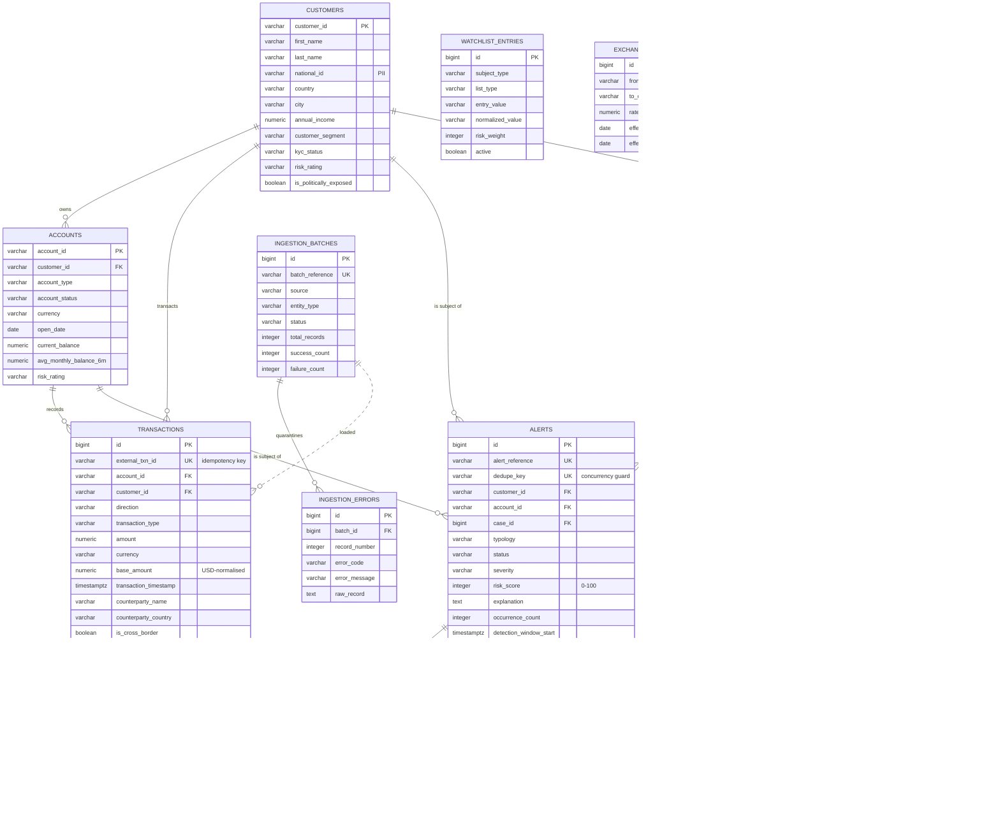

# Sentinel AML — Data Model (ERD)

Base currency: **USD**. Every monetary amount is stored in its original currency
*and* normalised to USD (`base_amount`) so a single set of thresholds works
across the whole book.

## Entity relationship diagram



`AUDIT_EVENTS` and `APP_USERS` are deliberately drawn without foreign keys.
The audit trail references entities by an `(entity_type, entity_id)` string pair
so that a row can never be orphaned or cascade-deleted along with the thing it
describes — an audit record must outlive its subject.

## The critical path

The flow the detection engine actually walks:

```
customers ──< accounts ──< transactions
                               │
                               ▼
              rule evaluation (rule_configs, watchlist_entries, exchange_rates)
                               │
                               ▼
     alerts ──< alert_triggered_rules   (why it fired)
        │   ──< alert_evidence ───────► transactions   (what it fired on)
        ▼
    aml_cases ──< case_notes
        │
        ▼
    audit_events (every transition, append-only)
```

## Design decisions worth knowing

| Decision | Reason |
|---|---|
| Natural string PKs on `customers` / `accounts` (`CUST_00001`, `ACC_000001`) | The source CSVs use these identifiers, so ingestion resolves foreign keys without a lookup table or a second pass. |
| `transactions.external_txn_id` is `UNIQUE` | Re-running a feed is idempotent. Replaying a file cannot double-count a transaction or raise duplicate alerts. |
| `alerts.dedupe_key` is `UNIQUE` | Database-level guarantee that concurrent detection threads cannot raise two alerts for the same `customer + typology + time window`. A repeat detection increments `occurrence_count` instead. |
| `version` column on `alerts` and `aml_cases` | Optimistic locking. Two analysts acting on the same alert cannot silently overwrite each other. |
| `base_amount` + `base_currency` on every transaction | Rules compare one normalised number. No per-rule currency logic, no per-evaluation FX lookups. |
| `exchange_rates` is effective-dated | An alert re-opened a year later re-evaluates with the rate that applied on the transaction date, so investigations are reproducible. |
| Enums stored as `varchar` + `CHECK`, not native PG enum types | Adding a value is an ordinary migration rather than an `ALTER TYPE`, and the columns stay readable in ad-hoc SQL. |
| `case_notes`, `audit_events`, `ingestion_errors` are immutable | Append-only by construction. There is no update path in the mapping, so the evidential record cannot be rewritten. |
| `ingestion_errors` quarantine table | One malformed row fails that row, not the batch. Errors are inspectable and re-submittable. |
| Composite indexes `(account_id, transaction_timestamp)` and `(customer_id, transaction_timestamp)` | Every windowed rule — structuring, rapid movement, behavioural deviation — filters by party plus time range. These two indexes serve all of them. |

## Alert lifecycle

```
NEW ──► ASSIGNED ──► IN_REVIEW ──┬──► CLOSED        (with disposition + analyst)
                      │          └──► ESCALATED ──► linked to an AML_CASE
                      └──► PENDING_INFO ──► IN_REVIEW
```

A `CHECK` constraint enforces that an alert cannot reach `CLOSED` without both a
`disposition` and a recorded `disposition_by`. Closing an alert is an
accountable act, so the schema refuses to record an anonymous one.

## Case lifecycle

```
OPEN ──► ASSIGNED ──► INVESTIGATING ──► PENDING_REVIEW ──┬──► CLOSED
                                                          └──► ESCALATED ──► SAR_FILED ──► CLOSED
```

## Seeded reference data (`V2__seed_reference_data.sql`)

| Table | Seeded content |
|---|---|
| `exchange_rates` | 12 currencies → USD, effective 2024-01-01. |
| `rule_configs` | 8 rules: the 5 mandated business rules plus round-amount, high-risk counterparty and dormant-reactivation. |
| `watchlist_entries` | FATF blacklist (3), FATF greylist (8), tax havens (7), fictional demo counterparties and banks (6). |
| `app_users` | One demo account per RBAC role. **Development credentials only — delete or rotate before any real deployment.** |
